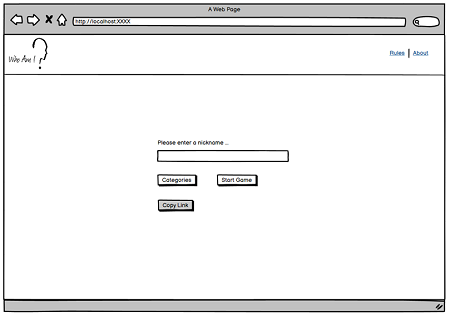
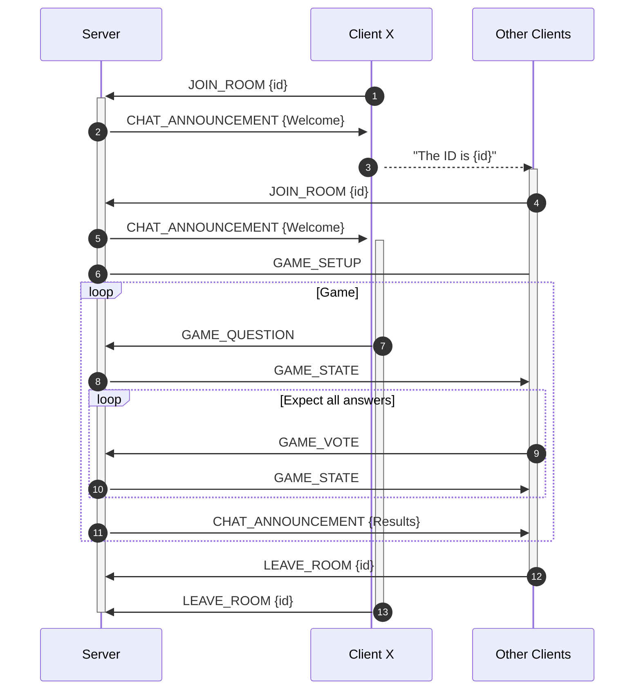
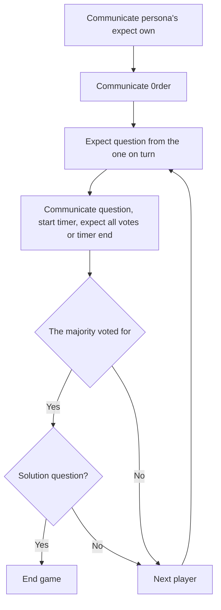

#  <br/> WebE, Web Engineering

**INF-P-WT002, BE-Sa-1, HS21/22, FFHS Bern** \
*unter der Leitung von Dr. Heinrich Zimmermann* \
*eingereicht von Ramona Koksa | Yves Bastian Pellaton*
***

## Inhalt

[[_TOC_]]

## Einführung

> «A game is a series of interesting choices.» – Sid Meier

Im Rahmen des Moduls Web Engineering (WebE) haben wir den Auftrag erhalten, ein Spiel zu entwickeln. Die
Rahmenbedingungen werden durch das Modul vorgegeben und werden aus dem Dokument «Projektarbeit_WebE-Beschreibung»
entnommen.

## Spielregeln

Das Spiel «Who Am I» ist ein Ratespiel, bei dem zwei oder mehr Spieler eine Person verkörpern und raten müssen wer sie
sind. Es dürfen nur Fragen, die mit «Ja» oder «Nein» beantwortet werden können (geschlossene Fragen) gestellt werden.
Werden die Fragen mit «Ja» beantwortet, dürfen weitere Fragen gestellt werden. Wenn nicht, dann ist der nächste Spieler
dran. Ziel ist es möglichst schnell zu erraten, wen man verkörpert.

Das Benutzerhandbuch befindet sich unter: [doc](doc/benutzerhandbuch.md)

## Projektziele

| ID | Systemziele                                                                              | *M*uss / *K*ann |Erreicht
|----|------------------------------------------------------------------------------------------|:-------------:|:------:|
| 1  | Das System soll die Benutzer über eine ansprechende, grafische Oberfläche führen.        | M           |:white_check_mark:|
| 2  | Die Kommunikation des Spiels muss über einen Chat stattfinden.                           | M           |:white_check_mark:|
| 3  | Es müssen mind. drei Levels mit unterschiedlichen Schwierigkeitsstufen sein.             | M           |:white_check_mark:|
| 4  | Das System soll auf Deutsch und Englisch zur Verfügung stehen. Standardsprache: Englisch | M           |:white_check_mark:|
| 5  | Die Kommunikation kann via Voice stattfinden                                             | K           |:red_circle:|

| ID | Vorgehensziele                                                               | *M*uss / *K*ann |Erreicht
|----|------------------------------------------------------------------------------|:-------------:|:-------:|
| 1  | Die Entwicklung des Projektes soll iterativ erfolgen                         | M           |:white_check_mark:|
| 2  | Termine und Deadlines sind einzuhalten.                                      | M           |:white_check_mark:|
| 3  | CI / CD soll angewendet werden | K           |:white_check_mark:|

### Arbeitsablauf

1. Ein Issue wird erstellt. Er bekommt entsprechende Tags und verwendet wo vorhanden die Vorlage.
2. (Bei Grossem Aufwand oder Impact) Der Issue wird diskutiert und mit ~"status::todo" als beriet für die Entwicklung
   markiert
3. Der Issue wird assigend und wenn begonnen wird mit ~"status::progress" markiert. Es wird
   aus [dev](https://git.ffhs.ch/ramona.koksa/whoami/-/tree/dev) ein neuer branch erstellt. Es kann bereits ein
   merge-request erstellt werden, dieser sollte aber als `DRAFT:` makiert sein.
4. Mit `/spend` kann die verwendete Zeit getrackt werden.
5. Ist der Code ready, wird ein merge-request erstellt oder beim bestehenden die `DRAFT:` markierung entfernt. Der
   merge-request ist mit dem issue zu verknüpfen: `Resolves #9` sollte reichen. Es ist sicherzustellen, dass der branch
   auf dev rebased ist und die History sauber ist.
6. Die andere Person assignen und das label ~"status::review" setzen.
7. Die andere Person reviewt die Arbeit, gibt Feedback und fordert die Definition of Done ein. Ist sie glücklich, merget
   sie nach dev.

Das Projekttagebuch kann unter [doc](doc/journal.md) eingesehen werden.

### Definition of Done

- Die verwendeten Bibliotheken (Libraries) werden dokumentiert
- Beschreibung der Funktionalität erstellt
- Struktur des Programms dokumentiert
- Entsprechende Userdokumentation erstellt
- Testbare Funktionalität getestet
- Peer reviewed

***

## Anforderungen

Sämtliche Anforderungen (funktional- und nicht-funktional) werden im vorliegenden Repository
unter [issues](https://git.ffhs.ch/ramona.koksa/whoami/-/issues) beschrieben. Die User Stories werden mit dem Label 
~user-story versehen. 
Einen ersten Überblick verschaffen die nachfolgenden Wireframes.




## Getting started

1. [node.js](https://nodejs.org/) installieren, Version >= 16.6.0 (Auf Linux via `apt install node`)
2. Repository klonen
3. Dependencies des Servers installieren
4. Via `npm start` den Server starten
5. Zweites Terminal öffnen
6. Zum Client wechseln
7. Dependencies des Clients installieren
8. Via `npm start` den Client starten

```bash
git clone
npm ci
npm start

cd /client
npm ci
npm start
```

Auf Linux würde es wie folgt funktionieren:
```bash
git clone
npm ci
cd /client
npm ci
cd ..
npm run start-all
```

## Technologiestack
#  <br/>

* MongoDB: Dokumentendatenbank
* Express: Node.js Webframework
* React: Clientseitiges JS-Framework
* Node: Führender JS-Webserver

## Architektur

Die Applikation besteht aus zwei Teilen: dem Frontend und dem Backend. Diese werden in den folgenden Abschnitten
beschrieben gemeinsam existiert [der common Ordner](client/src/common), auf welchen auch das Backend zugreift.

### Backend

Das Backend ist ein simples `express` mit einem server.js, welches sowohl websockets als auch http requests
entgegennimmt. Einzelne Teile wurden hier Ausgelagert, unter anderem das Game-Management, das User-Auth-Handling und das Raum-Management.

Die Schnittstellen wurden via Swagger dokumentiert und können im Backend wie folgt eingesehen werden: http://localhost:5000/doc.

### Frontend

Das Frontend ist React basiert und befindet sich under [client/](client/). Bei der Entwicklung existiert hierzu ein
development server, welcher jeweils einen build erstellt und diesen an den Client sendet. Für den Kunden kann dann ein
produktiv build erstellt und deployed werden.

#### Frontend Struktur

```
├───assets
│   ├───fonts
│   └───scss
│       ├───paper-kit
│       │   ├───cards
│       │   ├───mixins
│       │   └───plugins
│       └───react
│           ├───paper-kit
│           └───plugins
├───common
├───_actions
├───_components
     |─── Chat.js
     |─── ChatMessage.js
     |─── Footer.js
     |─── Game.js
     |─── GameInfo.js
     |─── GameSelection.js
     |─── Highscore.js
     |─── Home.js
     |─── index.js
     |─── LandingPage.js
     |─── Login.js
     |─── NavigationBar.js
     |─── PopupAlert.js
     |─── PrivateRoute.js
     |─── Register.js
     |─── Rules.js
     |─── UserStatsBadge.js
├───_constants
├───_helpers
├───_reducers
└───_services
```

### Protokoll Client Server

Folgende Diagramme beschreiben die Kommunikation zwischen Clients und Server. Client X ist jeweils ein spezifischer
Client, Other Clients beschreibt eine beliebige Anzahl anderer Clients.

Nachrichten und deren Aufbau können [im common Ordner](client/src/common) gefunden werden.

#### Chat & Nachrichten

Jederzeit kann ein User etwas in den Chat schreiben. Für die Spiellogik stehen auf dem Client entsprechende
Controls zur Verfügung. So werden die Nachrichten entweder als entsprechende Interaktion gesendet.

Der Server wertet die Interaktionen gemäss dem Spielablauf aus, Chat-Nachrichten werden an alle (auch den Sender) im
Raum multicasted. Broadcasts sind möglich aber nicht verwendet. Beim nachjoinen in ein laufendes Spiel werden Informationen 
per Singlecast dem Joiner mitgeteilt.

#### Join & Leave



#### Game loop, Serverseitig



### Frameworks

Exact packages and versions can be found in the [server package.json](./package.json) and
the [client package.json](client/package.json).

#### Server dependencies

1. `express`:   Das ist der node web server
2. `socket.io`: Dieses Framework umschliesst die Websockets für uns , hier der socket.io-Server
3. `nodemon`:   der node demon wird für automatische rebuilds bei Änderungen während der Entwicklung verwendet
4. `fs`:        wird verwendet um Daten auf einer JSON-Datei zu lesen
5. `mongoose`:  Ein Objektmodellierungstool für MongoDB
6. `bcrypt`:    Hashing von Passwörtern
7. `cors`:      CORS ist ein node.js-Paket zur Bereitstellung einer Connect / Express- Middleware, mit der CORS mit verschiedenen Optionen aktiviert werden kann.
8. `jsonwebtoken`: Einbindung von jwt-Tokens
9. `bodyparser` : Wird verwendet um eingehende Requests in einer Middleware zu analysieren.

#### Client dependencies

1. `react`: client-framework
2. `bootstrap`: css framework
4. `react-dom`, `react-scripts`, `web-vitals`:  react boilerplate von `create-react-app`
5. `react-router-dom`:  routing und navigation innerhalb der App
6. `socket.io-client`: Client Verbindung zum socket.io server
8. `axios`: HTTP-Client für Anfragen an unser Backend
9. `redux`: Wird verwendet, um den Zustand zwischen Komponenten zu verwalten
10. `react-redux`: Verwendung von Redux mit React
11. `redux-thunk`: Middleware für Redux, das ermöglicht einen direkten Zugriff auf die dispatch-Methode um asynchrone Aufrue tätigen zu können.
12. `jwt-decode`: Wird zum entschlüsseln verwendet
13. `reactstrap`: Wird für die Verwendung vom React-Theme benötigt

# API und Datenhaltung
Für die Registrierung eines Users und das LoginBody wurden zwei API's bereitgestellt:

* http://localhost:5000/api/register
* http://localhost:5000/api/login

## Registrierungslogik
1. Prüfe ob der User bereits existiert, wenn ja, dann wird ein Fehler geworfen - `email already exists`
2. Wenn der User noch nicht existiert, dann wird das Passwort verschlüsselt via `bcrypt`
3. `name`, `password` und `email` werden in der MongoDB persistiert.

## Loginlogik
1. Zunächst wird geprüft ob der User existiert, wenn nicht, dann wird ein Fehler geworfen - `user not found`
2. Wenn der User existiert, dann wird via `bcrypt.compare()` das Password geprüft.
3. Der jwt-Token wird für eine Stunde aktiviert.
4. Wenn alles funktioniert hat, wird eine Response mit Status `<200 OK>` zurückgegeben.

# Testkonzept
Im Rahmen des Projektes wurde entschieden, dass nur die Teststufe Unit abgedeckt wird. Die Teststufen Integration und System werden entsprechend nur bei Bedarf abgedeckt. 
Das Frontend wird manuell getestet. Allfällige Bugs sind im Gitlab unter issues zu erfassen. Bei den Bugs wird zwischen den folgenden Kritikalitäten unterschieden:
* Blocker: Die Applikation funktioniert als Ganzes nicht, z.B. Spiel kann nicht gestartet werden.
* Critical: Der Bug wirkt sich auf kritische Funktionen der Applikation aus, z.B. Nutzer kann sich nicht registrieren.
* Major: Der Fehler wirkt sich auf die Hauptfunktionalität aus, z.B. Chat funktioniert nicht richtig.
* Minor: Der Fehler wirkt sich auf geringfügige Funktionen aus, z.B. Button wird nicht wie gewünscht angezeigt.
* Trivial: Der Bug hat keine Auswirkung auf die Funktionalität, z.B. ein subjektives «Nice-to-have».

Nach jedem Commit werden die Tests automatisch in der Gitlab CI/CD ausgeführt. Gemerged darf nur werden, sobald alle Tests durchgelaufen sind.
Non-functional (NFR) Testfälle werden bei Bedarf ebenfalls automatisiert. Dies ist aber der Entwicklung selbst überlassen. 
Auf die statische Codeanalyse wird bewusst verzichtet. Leider bietet das FFHS-Git keine Möglichkeit, Sonarqube bzw. Sonarcloud in die CI/CD-Pipeline mitaufzunehmen.
Schlägt ein Test fehl, ist zu prüfen, ob es bei der Umsetzung von neuen Features neue Bugs generiert hat oder ob der Test nicht mehr valide ist.

