# Benutzerhandbuch

Nachdem Sie die Applikation erfolgreich installiert und gestartet haben, landen Sie auf die Startseite.
Stellen Sie bitte sicher, dass Sie mit dem Internet verbunden sind. Offline kann das Spiel nicht gespielt werden.

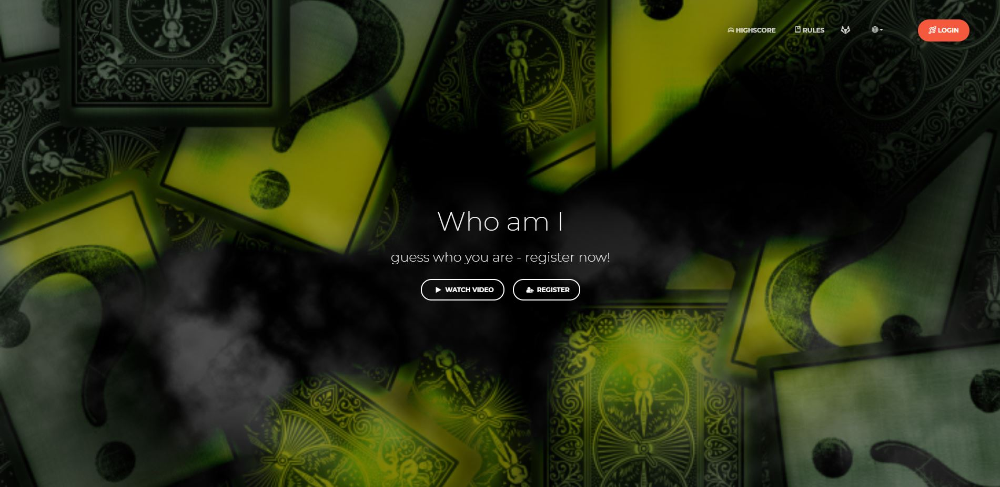

Scrollen Sie auf der Hauptseite nach unten, so finden Sie Informationen rund ums Projekt.

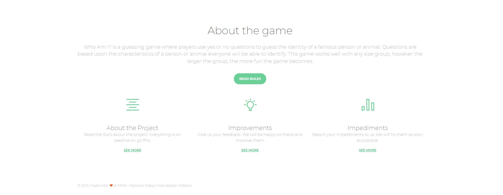

Sind Sie noch ausgeloggt, so sehen Sie den folgenden Header:

Navigieren Sie zur Seite /rules, so können Sie die detaillierten Spielregeln einsehen.

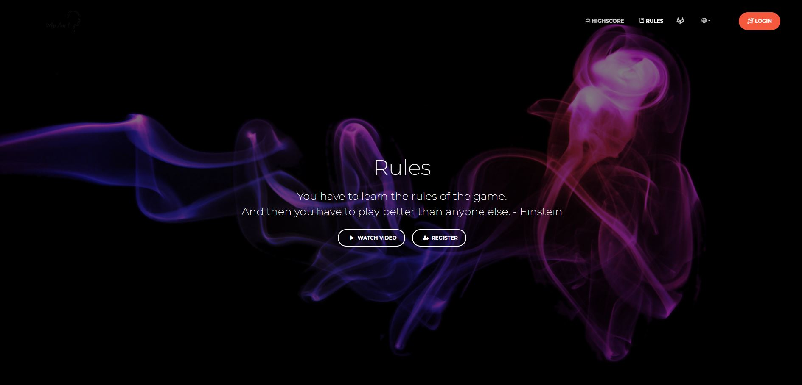
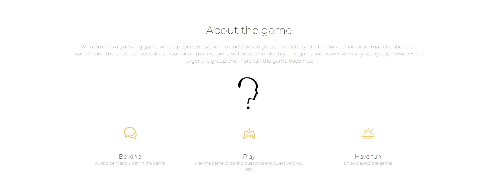
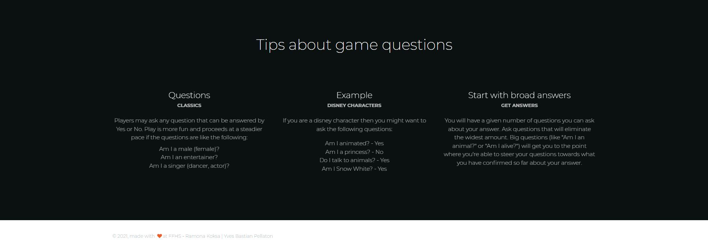

Die Highscore Seite gibt eine Rangliste sortiert nach Top-Spieler:

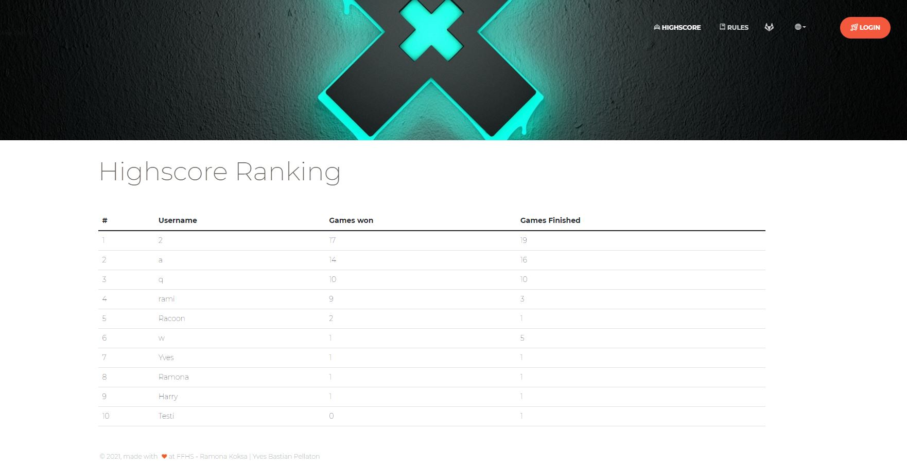

Via /register kann man sich registrieren. Hinweis: Es wird nur geprüft, ob eine E-Mail bereits vergeben wurde.
Die Passwörter werden mit einem slow hash von `bcrypt` verschlüsselt in die DB persistiert.

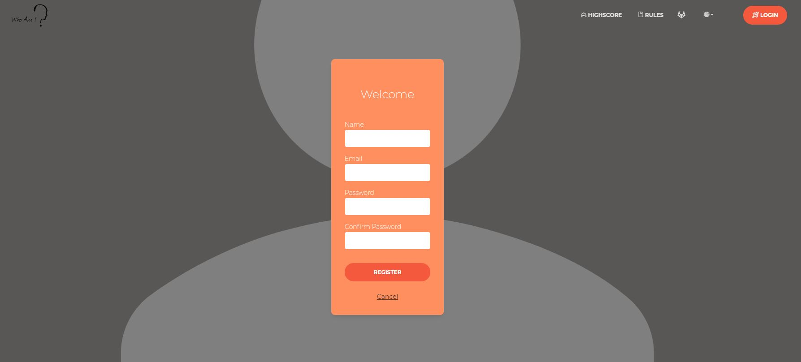

Nach der Registrierung gelangen Sie auf die /login Seite. Sie können Sie direkt nach der Registrierung einloggen.

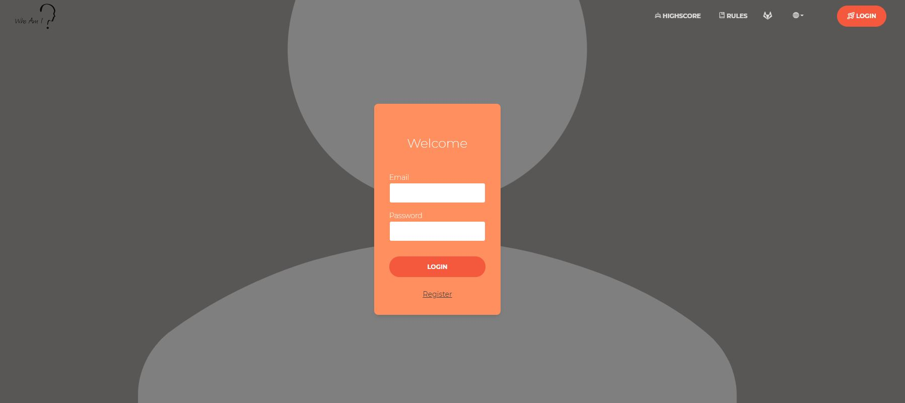

Nachdem Sie eingeloggt sind, hat sich im Header einiges geändert. Wie Sie sehen erscheint ein Play-Item sowie einige Spielstatistiken:

Auf der Startseite sehen Sie bereits gestartete Spiele oder können ein neues Spiel starten:

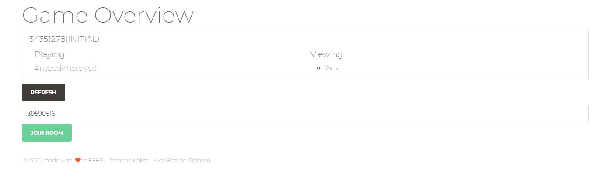

Hinweis: Im Textfeld kann ein beliebiger Spielname eingegeben werden:

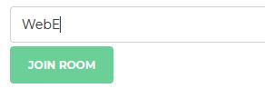

Gelangt man auf die Spielseite so sieht man einen Links- und einen Rechtspanel:

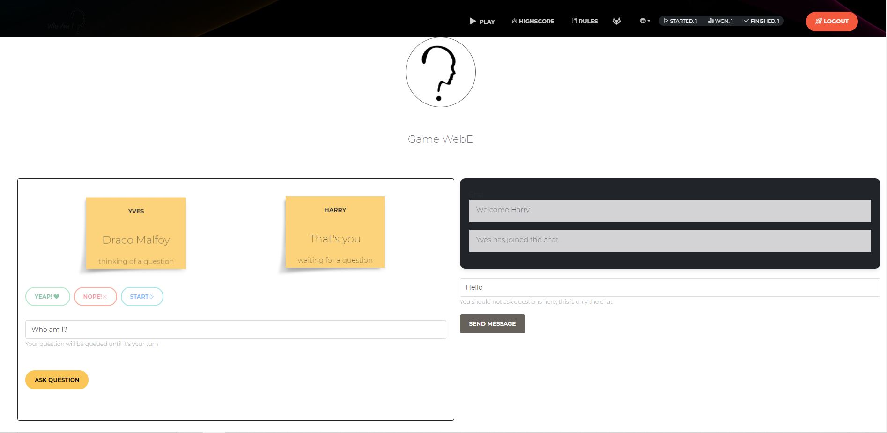

Auf der linken Seite befinden sich sämtliche Spielelemente. Die Fragen können im Textfeld eingegeben werden und erscheinen im Postit.
Via Buttons kann der andere Spieler voten, ob die Frage korrekt oder falsch gestellt wurde. Hat der Spieler die Persona herausgefunden, so wird er informiert:

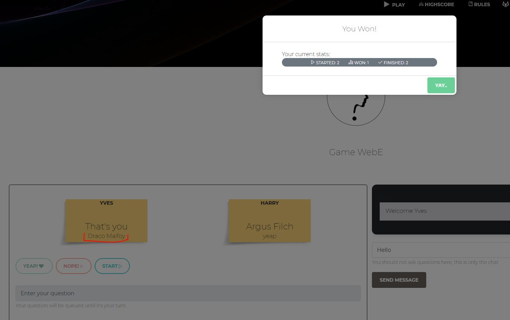

Hat man gewonnen, so gelangt man automatisch zum nächsten Level.

Das gesamte Spiel ist responsive und kann auf unterschiedlichen Grössen gespielt werden:

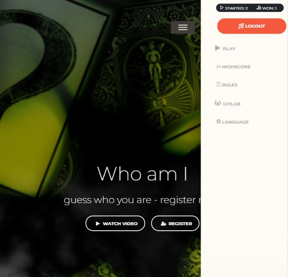

